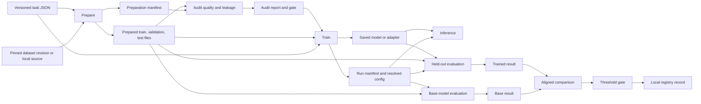

# Governed task workflow

The task file is the input to preparation and training. Evaluation and
inference read the task configuration copied into the run. The preparation
manifest fingerprints the files; the run manifest binds the saved config,
model artifacts, prepared-data snapshot, model and tokenizer revisions,
prompt version, seed, decoding defaults, Git state, and library versions.

The audit report is a separate gate. It checks exact prompt overlap, likely
near duplicates, label distribution, and patterns resembling PII or secrets.
Training adds a tokenizer-based length audit before loading model weights.
Near-duplicate and sensitive-data checks are heuristics; review their counts
and the underlying local data before making policy decisions.

The optional `dvc.yaml` graph executes prepare, audit, train, trained and base
evaluation, and comparison in dependency order. Promotion is a separate
action on test results, so a model below the example thresholds does not
make the training pipeline fail. Historical scripts under
`src/horoscope_experiments/` are archival learning material; use the
[governed horoscope demo](../examples/horoscope_governed.md) for new runs.
